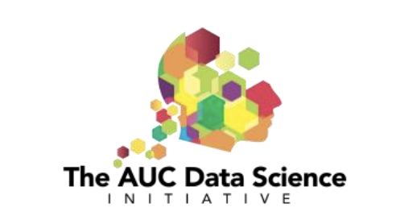

```{r setup, include=FALSE}
knitr::opts_chunk$set(echo = TRUE)
```





# Project Overview {#nextsteps .emphasized}

In this project, you will gain general knowledge about the emerging importance of quantum computing: its roles and use cases in the wider industrial world as the major players in quantum such as IBM hurtle toward quantum advantage when quantum hardware develops to the point where quantum computers outperform their classical counterparts for their wide and expanding domain of groundbreaking applications. You will also understand why Programmers sometimes wonder why they should start learning QC when real, usable quantum computers are still years away. You have to realize, though, that writing software that involves QC is different from writing classical software. Although it is expected that there will be libraries that make it convenient for developers to use quantum computers, those libraries have to be written; and even then, it will require skills and knowledge to use the best tools for a particular project.

## Qiskit Import

The purpose of the first milestone of this Project is to stress that it is important from the beginning with quantum computing to realize that, as strange and counter intuitive as a number of quantum concepts are (and they do suffer from bad popular press in this regard), Qiskit is “just” another programming language with its own learnable rules and regulations. 

### Here below are some Python Libraries to add qiskit

```{python, echo=TRUE, eval=FALSE}
from qiskit import Aer, execute, assemble, transpile

from qiskit.circuit import QuantumRegister, ClassicalRegister, QuantumCircuit

from qiskit.visualization import plot_histogram, plot_bloch_multivector, plot_bloch_vector, plot_state_qsphere, plot_state_city

from qiskit.visualization import array_to_latex, visualize_transition, circuit_drawer
```


### Important Concepts about Quantum 

The general concept of <mark>Quantum Mechanics</mark>, how quantum mechanics are leveraged via Qubits to take advantage of <mark>Wave Particle Duality</mark>, <mark>Superposition</mark>, and <mark>Entanglement</mark>, and how the Observer Effect adds
additional challenges to quantum applications.

### Observer effect


[📄 Open The Quantum Leap PDF](the-quantum-leap.pdf)

## Watch the YouTube Video

[View Video about Observer Effect](https://www.youtube.com/watch?v=Rqh6CH1Hlvo)


# Day 1

What is Quantum?

Basically, “Quantum” is a branch of physics covering the very small and/or the very cold.
“Physics” to most of us, describes what happens when we hit a golf ball, play billiards, or watch
the ocean tides. We don’t understand the Newtonian physics involved, but we can generally
strike the cue ball into the target ball and sink the billiard shot. “Quantum Physics” governs
what happens when the scale is incredibly small (i.e., the size of an individual atom or photon) or
extremely cold (or both). At the scale of atoms or photons, physics are different and things like
“Superposition”, “Entanglement” and “wave-particle duality” happen. But rather than explain
these properties, suffice it to say that these are very interesting and powerful features which
scientists are using to do amazing things. <mark>Read more in:  Open The Quantum Leap PDF - Quantum Mechanics</mark>

**Slides 1 with Mentor:** Link to slides:

[View the Google Slides presentation](https://docs.google.com/presentation/d/1pihh1bgvob0EtGnNjDUEBEsEjPtyn4cPUDU3RACaKU8/edit?usp=sharing)


**Activity with Mentor**: Introduce Python as a Language

**Lab Day 1**: Complete Python Code with Mentor

**Template for Final Presentation:**

# Day 2

**Activity by the Instructor:** Investigate what is meant by the term "quantum advantage and write a brief description explaining what it is and its significance. Time: 15 mins. 

**Submit Answer in Kahoot:**

[View the Kahoot Submission](https://create.kahoot.it/share/question-1-pfx/3e993cf0-282a-4950-baff-6ebb56c823af)

**Kahoot Quiz with Instructor about Slides 1 with Mentor and readings:**

[View the Kahoot Quiz](https://create.kahoot.it/share/exploring-quantum-computing/f3f7d69d-1835-4ae8-84f7-c1e373c9f9a2)

**Slides 2 with Instructor:**

[View the Google Slides presentation](https://docs.google.com/presentation/d/1chIR5pmImynt7fxW5cClZDYPjrlLv-kLNCPCI_pxi9E/edit?usp=sharing)


**Activity with Mentor:** Traditional Machine Learning vs Quantum Machine Learning in Python Part 1

**Lab Day 2:** Complete Python Code with Mentor


# Day 3

**Activity by the Instructor:** Investigate the main types of quantum hardware and write a bullet point presentation to biefly summarise your findings (one bullet point per item and at most one URL per item).

**Submit Answer in Kahoot:**

[View the Kahoot Submission](https://create.kahoot.it/share/question-2-pfx/93b76656-ebc7-4f99-a43d-ddb388a0c778)

## Watch the YouTube Video

[View Video Quantum Computing Hardware and Platforms](https://www.youtube.com/watch?v=yqIa7xhb3ds)


**Slides 3 with Instructor:**

[View the Google Slides presentation](https://docs.google.com/presentation/d/1XFs1BMkP44_zO0kkxBn4G6b6HyiI02GzQqYQevI57MI/edit?usp=sharing)

**Activity with Mentor:** Traditional Machine Learning vs Quantum Machine Learning in Python Part 2

# Day 4

**Activity by the Instructor:** Investigate the major players involved in quantum. Establish their names and the type of quantum hardware they are using, developing, or hosting, and write a bullet point presentation to summarise your findings (at most two bullet points per company and at most one URL, should you wish, per company).

**Submit Answer in Kahoot:**

[View the Kahoot Submission](https://create.kahoot.it/share/question-3-pfx/b67058df-a34f-485f-ad50-534e5cda1df6)

**Activity with Mentor:** Traditional Machine Learning vs Quantum Machine Learning in Python Part 3

# Day 5

**Summary and Takeaways**

**Final Presentation Day**


