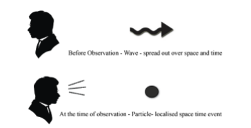

# Project Overview

In this project, you will gain general knowledge about the emerging
importance of quantum computing: its roles and use cases in the wider
industrial world as the major players in quantum such as IBM hurtle
toward quantum advantage when quantum hardware develops to the point
where quantum computers outperform their classical counterparts for
their wide and expanding domain of groundbreaking applications. You will
also understand why Programmers sometimes wonder why they should start
learning QC when real, usable quantum computers are still years away.
You have to realize, though, that writing software that involves QC is
different from writing classical software. Although it is expected that
there will be libraries that make it convenient for developers to use
quantum computers, those libraries have to be written; and even then, it
will require skills and knowledge to use the best tools for a particular
project.

## Qiskit Import

The purpose of the first milestone of this Project is to stress that it
is important from the beginning with quantum computing to realize that,
as strange and counter intuitive as a number of quantum concepts are
(and they do suffer from bad popular press in this regard), Qiskit is
“just” another programming language with its own learnable rules and
regulations.

### Here below are some Python Libraries to add qiskit

``` python
from qiskit import Aer, execute, assemble, transpile

from qiskit.circuit import QuantumRegister, ClassicalRegister, QuantumCircuit

from qiskit.visualization import plot_histogram, plot_bloch_multivector, plot_bloch_vector, plot_state_qsphere, plot_state_city

from qiskit.visualization import array_to_latex, visualize_transition, circuit_drawer
```

### Important Concepts about Quantum

The general concept of <mark>Quantum Mechanics</mark>, how quantum
mechanics are leveraged via Qubits to take advantage of <mark>Wave
Particle Duality</mark>, <mark>Superposition</mark>, and
<mark>Entanglement</mark>, and how the Observer Effect adds additional
challenges to quantum applications.

### Observer effect

<figure>

<figcaption aria-hidden="true">At the time of observation - particle-
localized space time event</figcaption>
</figure>

[📄 Open The Quantum Leap PDF](the-quantum-leap.pdf)
