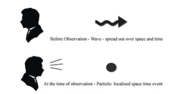

# Project Overview {#nextsteps .emphasized}

In this project, you will gain general knowledge about the emerging importance of quantum computing: its roles and use cases in the wider industrial world as the major players in quantum such as IBM hurtle toward quantum advantage when quantum hardware develops to the point where quantum computers outperform their classical counterparts for their wide and expanding domain of groundbreaking applications. You will also understand why Programmers sometimes wonder why they should start learning QC when real, usable quantum computers are still years away. You have to realize, though, that writing software that involves QC is different from writing classical software. Although it is expected that there will be libraries that make it convenient for developers to use quantum computers, those libraries have to be written; and even then, it will require skills and knowledge to use the best tools for a particular project.

## Qiskit Import

The purpose of the first milestone of this Project is to stress that it is important from the beginning with quantum computing to realize that, as strange and counter intuitive as a number of quantum concepts are (and they do suffer from bad popular press in this regard), Qiskit is “just” another programming language with its own learnable rules and regulations. 

### Here below are some Python Libraries to add qiskit


```python
from qiskit import Aer, execute, assemble, transpile

from qiskit.circuit import QuantumRegister, ClassicalRegister, QuantumCircuit

from qiskit.visualization import plot_histogram, plot_bloch_multivector, plot_bloch_vector, plot_state_qsphere, plot_state_city

from qiskit.visualization import array_to_latex, visualize_transition, circuit_drawer
```


### Important Concepts about Quantum 

The general concept of <mark>Quantum Mechanics</mark>, how quantum mechanics are leveraged via Qubits to take advantage of <mark>Wave Particle Duality</mark>, <mark>Superposition</mark>, and <mark>Entanglement</mark>, and how the Observer Effect adds
additional challenges to quantum applications.

### Observer effect




[📄 Open The Quantum Leap PDF](the-quantum-leap.pdf)


